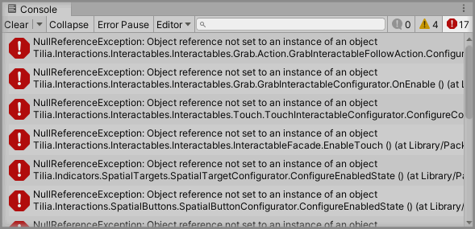
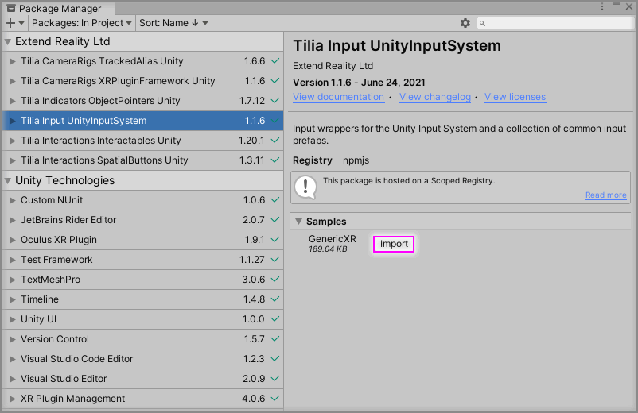
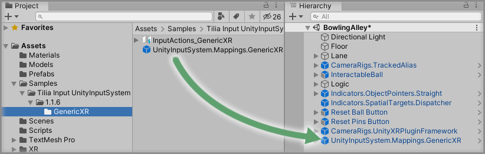

# Converting To Unity 2020

> * Level: Beginner
>
> * Reading Time: 10 minutes
>
> * Checked with: Unity 2020.3.12f1

# Introduction

You may have tried to build the VR bowling game or have just downloaded the project to try it yourself, but you're using Unity 2020 and you will have noticed that this VR bowling game just doesn't work.

Why? What's wrong with it?

Well, since Unity 2019.3.0f1, the [legacy Unity XR Management system] has become deprecated and since Unity 2020.1 it has been fully removed. Our VR bowling game relies on the [Unity XR Tilia package] which is basically a wrapper for this old legacy XR system and it no longer exists in Unity 2020.

So what can we do? Well, Tilia also has a package for the new [Unity XR Plugin Framework] that we can use to get everything working just as expected in Unity 2020.

The Unity software also has a new [Input System] as well, so we'll take a look at updating to that too.

## Prerequisites

* Complete the [Making A VR Bowling Game] tutorial.
* _Optionally_ complete the [Expanding The VR Bowling Game] tutorial.

## Let's Start

### Step 1

First thing we need to do is open our VR Bowling Game project in the Unity software. We're going to be using Unity 2020.3.12f1 for this tutorial as it is the latest version to date that has long term support (LTS version).

You will see a prompt when you open the VR Bowling Game project in the latest version of the Unity software. It's just telling us that the Unity software will upgrade our project to the version of Unity we have chosen.

Click the `Confirm` button to start the upgrade process (this may take some time).


### Step 2

We can then open up our `Scenes -> BowlingAlley` scene in the Unity software. So far, so good, we should have no errors and everything should _seem_ to be working as expected.

Let's just play the scene...



So we get a bunch of errors upon playing the scene, it seems like too much to fix! It's not, it's really simple, we just need to use the Tilia XR Plugin Framework package.

### Step 3

We're going to start by adding in the new Unity XR Plugin Framework package to our project. The easiest way to do this is via the `Project Settings` window.

In the Unity software select `Main Menu -> Edit -> Project Settings` to open the `Project Settings` window then select `XR Plugin Management` from the left hand menu in the `Project Settings` window.

We should see a button in the main `Project Settings` window panel that says `Install XR Plugin Management` as the XR Plugin Management package isn't installed yet. So just click the `Install XR Plugin Management` button to begin the installation process.


You will see a list of Plug-in Providers when the Unity XR Plugin Management package has installed. Now we just need to select the Plug-ins we want to support. For the purpose of this tutorial, we're just going to choose `Oculus` and this will allow any Oculus based headset to work.

> If you're not using an Oculus based headset then find your `Plug-in Provider` in the list and tick it.

This will now let the Unity software install the package for the selected Plug-in provider to ensure our headset and controllers work correctly within the Unity software.

### Step 4

We can now get rid of the old UnityXR stuff from our project and bring in the new Unity XR Management system package.

Let's delete the `CameraRigs.UnityXR` GameObject from our Unity Hierarchy as we no longer need this because it utilizes the unsupported legacy Unity XR Management system.

Next we're going to import the [Tilia.CameraRigs.XRPluginFramework.Unity] package into our project manifest.

Update the `dependencies` section of our Unity project `manifest.json` to include the following line:

```
"io.extendreality.tilia.camerarigs.xrpluginframework.unity": "1.1.6",
```

The latest version of this dependency is:

* Tilia.CameraRigs.XRPluginFramework.Unity: 

> You could also delete the reference to the UnityXR camerarigs package from your manifest at this point if you wanted:
> ```
> "io.extendreality.tilia.camerarigs.unityxr": "1.5.5",
> ```

Switch back to the Unity software and wait for it to finish importing the added package.

> Full installation instructions for this package can be found at the repository home page at [Tilia.CameraRigs.XRPluginFramework.Unity].

### Step 5

Set up the Tilia XRPluginFramework CameraRig in the scene by following the guide at:

* [Adding A Unity XRPluginFramework CameraRig]

Now we just need to update our `CameraRigs.TrackedAlias` GameObject to reference this newly added Camera Rig.

Drag and drop the newly added `CameraRigs.UnityXRPluginFramework` GameObject into the `Element 0` property value within the `CameraRigs` property on the `Tracked Alias Facade` component within the `CameraRigs.TrackedAlias` GameObject.


That's it, we're done! Our VR bowling game will now work as expected in Unity 2020.3.12f1. Play the scene and give it a go.

### Step 6

Now we have our project working in the latest version of the Unity software, we can now look at getting the new Unity Input System working.

Let's delete the `Input.UnityInputManager.OpenVR.LeftController` and `Input.UnityInputManager.OpenVR.RightController` GameObjects from our Unity Hierarchy as we no longer need these because they use the legacy Unity Input Manager.

We're going to import the [Tilia.Input.UnityInputSystem] package into our project manifest.

Update the `dependencies` section of our Unity project `manifest.json` to include the following line:

```
"io.extendreality.tilia.input.unityinputsystem": "1.1.6",
```

The latest version of this dependency is:

* Tilia.Input.UnityInputSystem: 

> You could also delete the reference to the UnityXR camerarigs package from your manifest at this point if you wanted:
> ```
> "io.extendreality.tilia.input.unityinputmanager": "1.4.5",
> ```

Switch back to the Unity software and wait for it to finish importing the added package.

> Full installation instructions for this package can be found at the repository home page at [Tilia.Input.UnityInputSystem].

The Unity software will prompt us to enable the new Unity Input System and restart the Unity software when the Unity Input System package has been installed.

Just click the `Yes` button and let the Unity software restart. Be sure to save any changes to your scene before restarting.

> The Unity software can get a bit glitchy after this restart for some unknown reason and start hiding the labels and fields of our components. It's very easy to fix with just another single restart of the Unity Software, so once the Unity software restarts after updating the Input System, then just do a manual restart to make sure everything is back to normal.

### Step 7

We now have the new Unity Input System installed and the Tilia package that wraps it. You may be wondering now where the Tilia prefabs are that utilize this new Unity Input System.

The Tilia package does not contain a default set of prefabs as the way the Unity Input System is meant to be used is to be configured for the game or experience that you are setting up, so instead of having a specific action for buttonA or buttonB, you set up a generic named action like "Jump" or "Shoot" and tie those actions to controller buttons.

Fortunately, we don't have to go through setting up those actions for this tutorial because the Tilia package comes with a simple sample controller layout that will work just fine for our VR bowling game.

We can add this sample from the Unity Package Manager window.

In the Unity software select `Main Menu -> Window -> Package Manager` to open the `Package Manager` window then select `Tilia Input UnityInputSystem` package from the left hand menu in the `Package Manager` window.

Expand the `Samples` section in the main `Package Manager` window panel and click the `Import` button next to the `GenericXR` sample.



> Close the `Package Manager` window when the samples are imported.

### Step 8

Expand the `Samples` directory in the Unity Project window and select the `Assets -> Samples -> Tilia Input UnityInputSystem -> 1.1.6 -> GenericXR` directory then drag and drop the `UnityInputSystem.Mappings.GenericXR` prefab into the Unity hierarchy window.



### Step 9

Now all we need to do is update the grab actions for our Interactors and the selection/activation action on our pointer to use the actions included in the `GenericXR` prefab.

Let's start by updating our left Interactor's grab action.

Drag and drop the `UnityInputSystem.Mappings.GenericXR -> InputActions -> LeftController -> Left_Grip -> LeftGrip_Press` GameObject into the `Grab Action` property on the `Interactor Facade` component within the `CameraRigs.TrackedAlias -> Aliases -> LeftControllerAlias -> Interactions.Interactor` GameObject.


> Do the same for the right Interactor's grab action.

Finally, let's update the selection and activation action on our pointer, which you will only have if you've followed the [Expanding The VR Bowling Game] tutorial.

Drag and drop the `UnityInputSystem.Mappings.GenericXR -> InputActions -> RightController -> Right_Thumbstick -> RightThumbstick_Touch` GameObject into the `Activation Action` property on the `Pointer Facade` component within the `Indicators.ObjectPointers.Straight` GameObject.

Then drag and drop the `UnityInputSystem.Mappings.GenericXR -> InputActions -> RightController -> Right_Thumbstick -> RightThumbstick_Press` GameObject into the `Selection Action` property on the `Pointer Facade` component within the `Indicators.ObjectPointers.Straight` GameObject.


### Done

We've now converted our VR bowling game to work with the latest Unity XR Plugin Framework and the new Unity Input System.

[legacy Unity XR Management system]: https://docs.unity3d.com/2018.3/Documentation/Manual/VROverview.html
[Unity XR Tilia package]: https://github.com/ExtendRealityLtd/Tilia.CameraRigs.UnityXR
[Unity XR Plugin Framework]: https://docs.unity3d.com/2019.3/Documentation/Manual/XR.html
[Input System]: https://docs.unity3d.com/Manual/com.unity.inputsystem.html
[Making A VR Bowling Game]: ../MakingAVRBowlingGame/README.md
[Expanding The VR Bowling Game]: ../ExpandingTheVRBowlingGame/README.md
[Tilia.CameraRigs.XRPluginFramework.Unity]: https://github.com/ExtendRealityLtd/Tilia.CameraRigs.XRPluginFramework.Unity
[Adding A Unity XRPluginFramework CameraRig]: https://github.com/ExtendRealityLtd/Tilia.CameraRigs.XRPluginFramework.Unity/tree/master/Documentation/HowToGuides/AddingAUnityXRPluginFrameworkCameraRig
[Tilia.Input.UnityInputSystem]: https://github.com/ExtendRealityLtd/Tilia.Input.UnityInputSystem