# Expanding The VR Bowling Game

> * Level: Intermediate
>
> * Reading Time: 45 minutes
>
> * Checked with: Unity 2019.4.19f1

# Introduction

We've made a very basic bowling game but it's hardly a game, there's no re-playability and the mechanics are very basic.

In this tutorial we will expand on our bowling game and add in some extra features such as some spatial buttons to allow us to reset the pins and recall the ball as well as making the ball bounce against the bumpers and have the pins vanish when they fall over.

## Prerequisites

* Complete the [Making A VR Bowling Game] tutorial.

## Let's Start

### Step 1

The first thing we can do is improve how our ball reacts when it hits the bumpers. Right now, our ball will just stick to the bumper and roll down the lane when it hits the bumper. What we really want is the ball to bounce off the bumper and change the direction.

We _could_ start delving into [Unity Physics Materials] but you may end up spending way too much time trying to recreate a bounce against the bumper and still not getting anywhere. So instead of using Physics Materials, we're going to add a bit of code to our bumpers that simply reverses the left/right velocity of our ball when the ball collides with the bumper.

First thing we need to do is make it so our bumpers can listen for collisions.

Select the `Lane -> Left Bumper` and `Lane -> Right Bumper` GameObjects in the Unity Hierarchy window and add a `Rigidbody` component.

We don't want our bumpers to have physics applied to them or be affected by gravity so let's check the `Is Kinematic` option on the newly created `Rigidbody` components.


We can now add `Collision Tracker` components to our Bumper GameObjects so we can call some code when a collision occurs. Still with the `Lane -> Left Bumper` and `Lane -> Right Bumper` GameObjects selected, add a `Collision Tracker` component to each of these GameObjects.

Now let's add a simple script to call when our ball hits our bumpers.

Create a new `Script` by selecting `Main Menu -> Assets -> Create -> C# Script` in the Unity software and name it `Bumper`.

Copy and paste the below code into the newly created `Bumper` script:

```
using UnityEngine;
using Zinnia.Tracking.Collision;

public class Bumper : MonoBehaviour
{
    public void Bounce(CollisionNotifier.EventData data)
    {
        data.CollisionData.rigidbody.velocity = Vector3.Reflect(data.CollisionData.rigidbody.velocity, Vector3.right);
    }
}
```

This script has a single method called `Bounce` which takes collision data values and upon calling it from our `CollisionTracker` will simply reflect the current ball velocity across the left/right direction.

Simply speaking this means when our ball collides with our bumper, if the ball is moving left then upon collision the direction of the ball will now be moving right, simulating a bounce off the bumper.

Add the `Bumper` script to the `Lane` GameObject.

> We don't need to add this script to both bumpers as the same script can be called from either bumper `CollisionTracker`.


Now we need to hook up our `CollisionTrackers` to call this `Bounce` method when something collides with the bumpers.

Select both the `Lane -> Left Bumper` and `Lane -> Right Bumper` GameObjects from the Unity Hierarchy window and click the `+` symbol in the bottom right corner of the `Collision Started` event parameter on the `Collision Tracker` component.

Drag and drop the `Lane` GameObject into the event listener box that appears on the `Collision Started` event parameter on the `Collision Tracker` component that displays `None (Object)`.

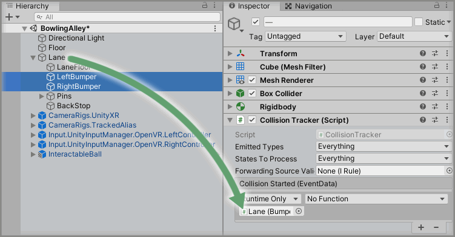

Select a function to perform when the `Collision Started` event is emitted. For this example, select the `Bumper -> Bounce` function (be sure to select `Dynamic EventData - Bounce` for this example).

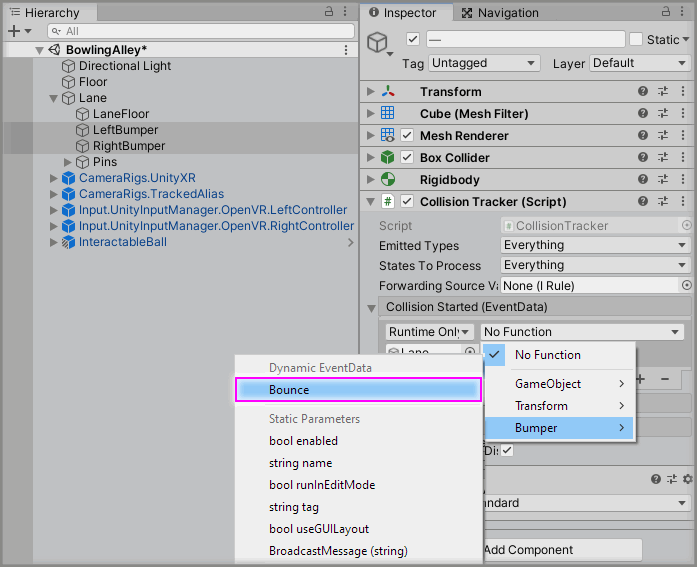

We can now roll our ball down the lane and if we hit the bumpers then our ball should bounce off nicely.

> [see commit #d65c70f](https://github.com/ExtendRealityLtd/VRTK.Tutorials.VRBowling/commit/d65c70f55ce7f124dafe7a839859db3743177b31)

### Step 2

Next thing we will want to do is have our ball come back to us when it reaches the end of the lane.

We can achieve this easily enough by just adding a GameObject to the back of our lane and when the ball hits it then we can just reset the position of our ball.

Let's start by moving our pins forward just a bit to give us space for the back collider.

Select the `Lane -> Pins` GameObject from the Unity Hierarchy window and change the `Transform` properties to:

* Position: `X = 0, Y = 0.52, Z = 5.4`


Let's create our back stop by creating a new `Cube` Unity 3D Object by selecting `Main Menu -> GameObject -> 3D Object -> Cube` and change the `Transform` properties to:

* Position: `X = 0, Y = 0.2, Z = 7.75`
* Scale: `X = 2.2, Y = 0.4, Z = 0.4`

Rename the new `Cube` to `BackStop` and drag and drop this GameObject to be a child of the `Lane` GameObject.

Create a new material by selecting `Main Menu -> Assets -> Create -> Material` in the Unity software and name it `BackStop`.

Change the `Albedo` property on the newly created `BackStop` material to whatever color you want the backstop to be, in the example project the `BackStop` material has a hex value of `333333`.

Apply the `BackStop` material to the `BackStop` GameObject.

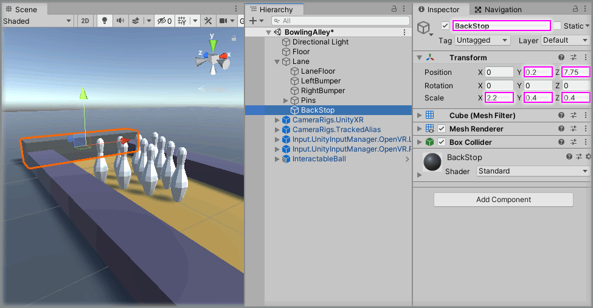

We're now going to set up a bit of logic using Zinnia components that resets our ball position.

Let's create an `Empty` GameObject to hold our logic by creating a new `Empty` GameObject by selecting `Main Menu -> GameObject -> Create Empty` and rename it to `Logic`.

Now within our new `Logic` GameObject, let's create another `Empty` GameObject to hold our ball reset logic by right clicking on the `Logic` GameObject in the Unity Hierarchy window and clicking on `Create Empty` from the context menu and rename it to `ResetBallPosition`. Change the `Transform` properties of the `ResetBallPosition` GameObject to match our initial ball position (which is the same as the `InteractableBall` GameObject position):

* Position: `X = 0, Y = 0.125, Z = -7.5`

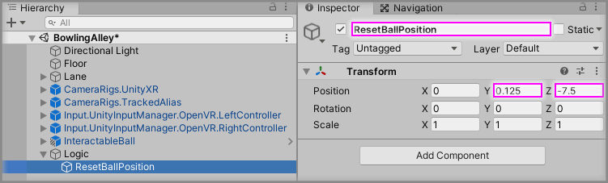

We can now add some Zinnia components to create this reset logic for us.

Select the `Logic -> ResetBallPosition` GameObject from the Unity Hierarchy window and click the `Add Component` button, then select the `Transform Property Applier` component.

This newly created `Transform Property Applier` will used to reset the position of our ball to the `Source` property.

We can just use the `ResetBallPosition` GameObject as our `Source` property as we already set the position of this GameObject to match the initial position of our ball.

Drag and drop the `Logic -> ResetBallPosition` GameObject into the `Source` property on the `Transform Property Applier` component within the `Logic -> ResetBallPosition` GameObject.

Now we need to say what GameObject we want to apply the source position to, well we already have a ball GameObject, so let's just update that.

Drag and drop the `InteractableBall` GameObject into the `Target` property on the `Transform Property Applier` component within the `Logic -> ResetBallPosition` GameObject.

Finally, we only want our `Transform Property Applier` to apply position transformations so select only the `Position` value on the `Apply Transformations` property on the `Transform Property Applier` component.


Our ball will most likely be moving when it hits our `BackStop` GameObject so if we just reset its position then it will still have velocity and continue moving forward. So our reset logic also needs to remove any velocity from our ball.

Select the `Logic -> ResetBallPosition` GameObject from the Unity Hierarchy window and click the `Add Component` button, then select the `Rigidbody Property Mutator` component.

Drag and drop the `InteractableBall` GameObject into the `Target` property on the `Rigidbody Property Mutator` component within the `Logic -> ResetBallPosition` GameObject.

We'll now be able to call methods on this component to remove any velocity from our ball.

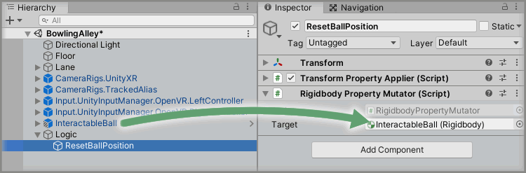

We have a couple of components here that will do all the logic we need for us, but we don't want to have to keep calling multiple components every time we want to reset our ball position. What we can do here is use an `Empty Event Proxy Emitter` that we can set up the relevant calls we want to these components, then any time we want to reset our ball position, we only have to call one method on this `Empty Event Proxy Emitter` component.

Select the `Logic -> ResetBallPosition` GameObject from the Unity Hierarchy window and click the `Add Component` button, then select the `Empty Event Proxy Emitter` component.

We're now just going to add three event listeners when the `Emitted` event on the `Empty Event Proxy Emitter` component is raised. Then we can simply call the `Receive` method on the `Empty Event Proxy Emitter` component and it will do everything we need.

Select the `Logic -> ResetBallPosition` GameObject from the Unity Hierarchy window and click three times on the `+` symbol in the bottom right corner of the `Emitted` event parameter on the `Empty Event Proxy Emitter` component.

Drag and drop the `Logic -> ResetBallPosition` GameObject into all of the event listener boxes that have appeared on the `Emitted` event parameter on the `Empty Event Proxy Emitter` component that displays `None (Object)`.

For each of the newly added event listeners, select the following functions in this order for each event listener:

* `RigidbodyPropertyMutator.ClearVelocity`
* `RigidbodyPropertyMutator.ClearAngularVelocity`
* `TransformPropertyApplier.Apply`


Now we have all of our logic set up, we just need to call it when our ball collides with the backstop. We can use the `Collision Tracker` component again just like we did with our bumpers to register when our ball hits the backstop.

Select the `Lane -> BackStop` GameObject in the Unity Hierarchy window and add a `Rigidbody` component.

Again, we don't want our backstop to have physics applied to it or be affected by gravity so let's check the `Is Kinematic` option on the newly created `Rigidbody` components.

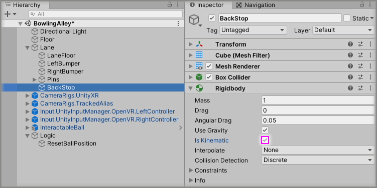

We can now add a `Collision Tracker` component to our `BackStop` GameObject to call our reset ball logic when a collision occurs. Still with the `Lane -> BackStop` GameObject selected, add a `Collision Tracker`.

Now we need to hook up our `CollisionTracker` to call the `Receive` method on our .`Empty Event Proxy Emitter`, which will call our reset ball position logic.

Select the `Lane -> BackStop` GameObject from the Unity Hierarchy window and click the `+` symbol in the bottom right corner of the `Collision Started` event parameter on the `Collision Tracker` component.

Drag and drop the `Logic -> ResetBallPosition` GameObject into the event listener box that appears on the `Collision Started` event parameter on the `Collision Tracker` component that displays `None (Object)`.

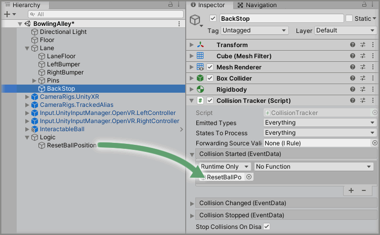

Select a function to perform when the `Collision Started` event is emitted. For this example, select the `EmptyEventProxyEmitter -> Receive` function.


If you now play the scene and roll the ball to the end of the lane, it should collide with our `BackStop` and call our reset ball position logic and return our ball back to the starting position.

> [see commit #bb0b9d0](https://github.com/ExtendRealityLtd/VRTK.Tutorials.VRBowling/commit/bb0b9d03ac82fb4d903b58521fbc9087087e66ab)

### Step 3

We now have the basis of a very simple bowling game, we can roll our ball down the lane and if it hits the bumpers it will bounce off, plus when it gets to the end of the lane then our ball will appear back at the original location for us to have another go.

We have a problem with our second go though, the fallen pins are still there. In a real game of bowling, the fallen pins would be cleaned away giving you a fresh lane to bowl against the remaining pins. We're not going to bother with complex mechanics of lifting the remaining pins and sweeping away the fallen pins, this isn't reality so we can just cheat and make any fallen pins just simply disappear after a few seconds.

To do this, we're going to add a custom script to each of our pins that holds the logic to know when a pin has fallen over and when it should disappear. We have ten pins but we don't want to have to add this script ten times for each pin and we don't have to because we made our pin a Unity prefab. This means we can simply open up our pin prefab and make the changes once, which will be applied to every pin in the scene.

The easiest way to open our prefab is to expand the `Lanes -> Pins` container GameObject in the Unity Hierarchy window and then next to any of the `Pin` GameObjects you should see a grey right pointing arrow to the right of the GameObject name. If you click on that arrow then it will open the prefab that this GameObject is based on.


Now let's make our custom script to monitor our pin state.

Create a new `Script` by selecting `Main Menu -> Assets -> Create -> C# Script` in the Unity software and name it `Pin`.

Copy and paste the below code into the newly created `Pin` script:

```
using UnityEngine;
using Zinnia.Extension;

public class Pin : MonoBehaviour
{
    public float pinFallThreshold = 0.02f;
    public float toppleLife = 3f;
    public int tries = 10;

    private Quaternion defaultRotation;
    private int currentTries;

    protected void Awake()
    {
        defaultRotation = transform.localRotation;
    }

    public void CheckTopple()
    {
        CancelToppleCheck();
        CheckRotation();
        InvokeRepeating("CheckRotation", 0f, 1f);
    }

    public void CancelToppleCheck()
    {
        currentTries = 0;
        CancelInvoke("CheckRotation");
        CancelInvoke("HidePin");
    }

    protected void CheckRotation()
    {
        currentTries++;
        if (!Mathf.Abs(Quaternion.Dot(defaultRotation, transform.localRotation)).ApproxEquals(1f, pinFallThreshold))
        {
            Invoke("HidePin", toppleLife);
        }
        else
        {
            if (currentTries > tries)
            {
                CancelToppleCheck();
            }
        }
    }

    protected void HidePin()
    {
        gameObject.SetActive(false);
    }
}
```

There's quite a bit of code that we've just copied there, so let's go over it in chunks to get a better understanding of what's actually going on here.

```
    public float pinFallThreshold = 0.02f;
    public float toppleLife = 3f;
    public int tries = 10;
```

We start by setting up some public fields that hold the variables about our pin we want to control.

* `pinFallThreshold` determines how far the pin rotation needs to be away from a standing up position for us to consider the pin to have fallen over.
* `toppleLife` determines how long (in seconds) our pin will stay active for after falling over, so after this time has expired then our fallen pin will disappear.
* `tries` dictates how many times we're going to check if our pin has fallen over after it has been collided with. We don't want to check forever, if it's not fallen over within a few seconds of being hit then it's probably not going to fall over this time.

```
    private Quaternion defaultRotation;
    private int currentTries;
```

Next we just create some private fields to hold some data in about the operation of our code. Don't be afraid that you see the word `Quaternion` we're just using this for rotation data but we're not doing anything complicated with it.

```
    protected void Awake()
    {
        defaultRotation = transform.localRotation;
    }
```

Our first method is just implementing the Unity `Awake` method which is called once when the GameObject is first activated in the scene. All we want to do here is store the current rotation of the `Pin` transform. We know that when the pin is first active in the scene that it will be in a standing upright position so we can use this knowledge to know if our pin rotation is not the same as when it first started then it has probably fallen over.

> This logic is not perfect, there are better, more in-depth ways of determining this information but for our use case this will work just fine and is very simple to implement.

```
    public void CheckTopple()
    {
        CancelToppleCheck();
        CheckRotation();
        InvokeRepeating("CheckRotation", 0f, 1f);
    }
```

The `CheckTopple` method is our public method that we will call upon something colliding with the `Pin` to see if the pin has toppled over. It doesn't really do anything other than:

* `CancelToppleCheck()` calls another method that cancels any existing check that may be going on for a topple of this pin.
* `CheckRotation()` calls the actual logic in another method that checks to see if our rotation has changed.
* `InvokeRepeating("CheckRotation", 0f, 1f)` using the Unity `InvokeRepeating` method to keep calling our `CheckRotation` method every second after the `Pin` has been collided with. This is just in case our pin is wobbling but hasn't completely fallen down upon collision.

```
    public void CancelToppleCheck()
    {
        currentTries = 0;
        CancelInvoke("CheckRotation");
        CancelInvoke("HidePin");
    }
```

Our `CancelToppleCheck` method is simply a way we can cancel any existing check of whether our `Pin` is toppling. We already call this method in the `CheckTopple` method. Again, this is a very simple method that only does a few simple things:

* `currentTries = 0` resets the number of tries we have attempted to call the `CheckTopple` method as if we call it again we want to keep trying for our `tries` value.
* `CancelInvoke("CheckRotation")` calls the Unity `CancelInvoke` method which simply cancels any continuous check we've set up with the `Invoke` or `InvokeRepeating` Unity methods. Here we're just cancelling any call to our `CheckRotation` method.
* `CancelInvoke("HidePin")` again just cancels any calls to the `HidePin` method.

```
    protected void CheckRotation()
    {
        currentTries++;
        if (!Mathf.Abs(Quaternion.Dot(defaultRotation, transform.localRotation)).ApproxEquals(1f, pinFallThreshold))
        {
            Invoke("HidePin", toppleLife);
        }
        else
        {
            if (currentTries > tries)
            {
                CancelToppleCheck();
            }
        }
    }
```

This is the real logic behind this class, our `CheckRotation` method is how we check if our pin is rotated beyond our "we think it's fallen" threshold. There's a bit going on here so let's break it down:

* `currentTries++` just increases the count by 1 on the number of tries of checking this rotation (remember we only want to check ten times).
* `if (!Mathf.Abs(Quaternion.Dot(defaultRotation, transform.localRotation)).ApproxEquals(1f, pinFallThreshold))` is quite the condition to get our head around, so let's break it down further:
  * `if` we're only going to do the code inside the below curly braces if our condition is true.
  * `!` says we want the opposite boolean value to our condition, so if our condition is `true` then we only want to return `true` from the `if` statement if our value is actually `false`. Essentially we're saying "if this condition is not true then we want to do this code in the curly braces".
  * `Mathf.Abs` gives us the absolute value of a number, meaning it will only give us the positive version of a number e.g. Mathf.Abs(-2) is 2, because -2 is not positive.
  * `Quaternion.Dot(defaultRotation, transform.localRotation)` gets us the Dot product of two Quaternions and instead of going into the maths behind this, just know this is the code that will tell us whether our pin has changed from its initial `defaultRotation` against the current `transform.localRotation`.
  * `ApproxEquals(1f, pinFallThreshold)` returns `true` if our `Dot` product of our two Quaternions is approximately `1` within the given threshold of our variable `pinFallThreshold`. So if our `Dot` product was `0.985f` then this isn't equal to `1` but it's near enough to `1` (and within our threshold) for us to consider it to be true.
  * So this whole line basically is saying "if the positive value of our quaternion Dot product is not nearly 1 then we want to conside our pin to have fallen over". If our Dot product is not nearly `1` then it means the current rotation of the pin is far enough away from it's default standing rotation for us to think that it has been toppled.
* `Invoke("HidePin", toppleLife)` simply calls the Unity `Invoke` method to call our `HidePin` method after a certain number of seconds defined by our `toppleLife` variable.
* `else` if our original `if` condition did not succeed (because the pin hasn't toppled) then we want to do what is in the below curly braces.
* `if (currentTries > tries)` is a nested condition to check if we've tried to check our pin topple state more times than we wanted to. If our `currentTries` is larger than the number of `tries` we actually want, then we will run the code in the nested curly braces.
* `CancelToppleCheck()` cancels this repeating topple check if we've exceeded our tries.

Well there was a lot to digest there, but hopefully you've been able to follow along and see whilst the logic may seem complicated, once you break it down then it's really not doing too much.

```
    protected void HidePin()
    {
        gameObject.SetActive(false);
    }
```

Our final `HidePin` method simply sets our current `Pin` GameObject active status to `false` meaning it will vanish from our scene.

Add the `Pin` script to the `CollidableBowlingPin` prefab GameObject.


We can now add a `Collision Tracker` component to our Pin prefab GameObject so we can call this `CheckTopple` method when something hits our `Pin`. Still with the `CollidableBowlingPin` GameObject selected, add a `Collision Tracker` component.

Now we need to hook up this `CollisionTracker` to call this `CheckTopple` method when something collides with the pin.

Select the `CollidableBowlingPin` GameObject from the Unity Hierarchy window and click the `+` symbol in the bottom right corner of the `Collision Started` event parameter on the `Collision Tracker` component.

Drag and drop the `CollidableBowlingPin` GameObject into the event listener box that appears on the `Collision Started` event parameter on the `Collision Tracker` component that displays `None (Object)`.


Select a function to perform when the `Collision Started` event is emitted. For this example, select the `Pin -> CheckTopple` function.


Make sure to save the prefab and exit the prefab editing by clicking the left arrow next to the prefab name in the Unity Hierarchy window.

You'll now notice every pin in your scene has this new `Pin` script on it and a `Collision Tracker` component hooked up to call our `CheckTopple` method every time a pin is collided with. This is because we changed our prefab for the `Pin` and every instance of that prefab is automatically updated with any changes.

Play the Unity scene and roll the ball down the lane, hit some pins and watch them disappear a few seconds after falling over.

> If you notice that your ball isn't hitting the pins with enough force, then just increase the `Mass` on the `Rigidbody` component on the `InteractableBall` GameObject. A `Mass` value of `10` provides a good weighty ball that should knock the pins down with ease.

> [see commit #a0aa365](https://github.com/ExtendRealityLtd/VRTK.Tutorials.VRBowling/commit/a0aa365a798736e3cf1c577d9e0d4d812ca13b1f)

### Step 4

We have the basics of a game now, we can roll our ball down the lane, knock over some pins and get the ball back for another go. But have you noticed that sometimes your ball doesn't actually get to the end of the lane and doesn't re-spawn? The ball perhaps gets stuck on a pin and loses all of its momentum and doesn't roll to our backstop so it cannot call the reset ball position logic.

We could solve this maybe by using a larger trigger collider at the end of the lane and when our ball enters this trigger collider then we reset the position after a certain amount of time. But instead of doing that, let's set up some spatial buttons that we can click on and perform certain tasks.

So, we can set up a Spatial Button that simply resets the ball whenever we click on the button with our pointer.

We need to add the Tilia ObjectPointers package to our project, which will give us the ability of casting a pointer from our controller to select our buttons. Let's add a Straight Pointer to our scene by following the [Adding A Straight Pointer] how-to guide.

It uses the Simulated CameraRig controls in the [Adding A Straight Pointer] guide, but for our project we will update this to use our VR controller mappings.

We need to update our Straight Pointer to listen to the Touchpad/Thumbstick Button touch on our controller to activate our pointer and we'll make pressing the Touchpad/Thumbstick Button on our controller make a selection with the pointer.

Expand the `Input.UnityInputManager.OpenVR.RightController -> Input Actions -> RightTrackpad` and drag and drop the `RightTrackpad_Touch[17]` GameObject onto the `Activation Action` property on the `Pointer Facade` component of the `Indicators.ObjectPointers.Straight` GameObject.

Then drag and drop the `RightTrackpad_Press[9]` GameObject onto the `Selection Action` property on the `Pointer Facade` component of the `Indicators.ObjectPointers.Straight` GameObject.


We now have a Straight Pointer on our right VR controller in our scene that we can activate by touching our touchpad/trackpad and make a selection by pressing down on the touchpad/trackpad button.

> [see commit #bc25588](https://github.com/ExtendRealityLtd/VRTK.Tutorials.VRBowling/commit/bc255887021f446378dd6e995d9b618db9700bb7)

### Step 5

We can now add a Spatial Button that we can interact with via our newly added Straight Pointer.

We need to add the Tilia Spatial Buttons package to our project, which will give us 3D Button objects that we can interact with via our pointer and call actions upon clicking them. Let's add a Click Button to our scene by following the [Adding A Click Button] how-to guide from Step 3 onwards as we don't need to modify the Straight Pointer as we already have it set up how we want it from [Step 4](#Step-4) of this guide.

The Click Button that was added in the [Adding A Click Button] how-to guide is mostly what we need but let's just change some of the settings on our button.

Select the `Interactions.SpatialButton.ClickButton` GameObject from the Unity Hierarchy window and rename it to `Reset Ball Button` then change the `Transform` properties to:

* Position: `X = 1.5, Y = 1.5, Z = -7.5`
* Rotation: `X = 0, Y = 40, Z = 0`

Then update the Button Styles on the `Spatial Button Facade` component to change the wording on the different states of the buttons:

* Enabled Inactive -> Button Text: `Reset Ball`
* Enabled Hover -> Button Text: `Reset Ball`
* Enabled Active -> Button Text: `Reset Ball`
* Disabled Inactive -> Button Text: `Reset Ball`
* Disabled Hover -> Button Text: `Reset Ball`


Next we want to make our new button reset the ball position when we actually click it. We already have the logic on how to reset our ball position from [Step 2](#Step-2) so all we need to do is hook our button click up to that logic.

Select the `Reset Ball Button` GameObject from the Unity Hierarchy window and click the `+` symbol in the bottom right corner of the `Activated` event parameter on the `Spatial Button Facade` component.

Drag and drop the `Logic -> ResetBallPosition` GameObject into the event listener box that appears on the `Activated` event parameter on the `Spatial Button Facade` component that displays `None (Object)`.

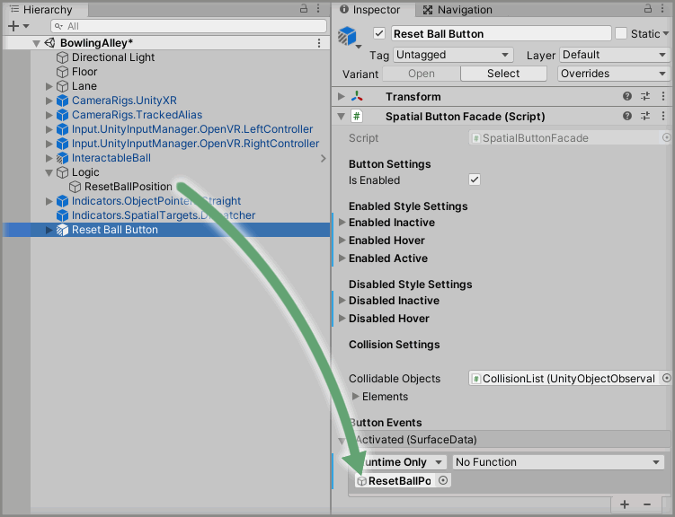

Select a function to perform when the `Activated` event is emitted. For this example, select the `EmptyEventProxyEmitter -> Receive` function.

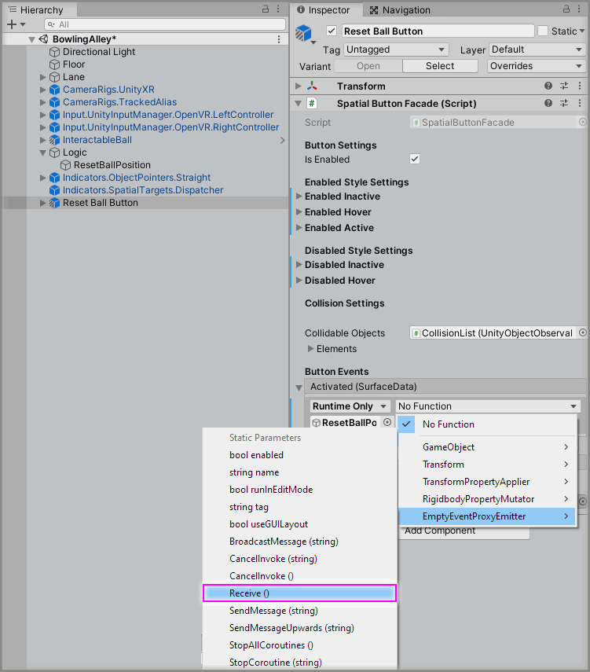

Play the Unity scene and if your ball hasn't made it all the way down to our backstop then you can now simply select the `Reset Ball` button with the newly added Straight Pointer and it will call our same reset ball position logic and put our ball back to where it started.

> [see commit #86d3b9b](https://github.com/ExtendRealityLtd/VRTK.Tutorials.VRBowling/commit/86d3b9bbd462b38656207b6473f0076d6b31568f)

### Step 6

The last thing we'll look at doing in this tutorial is making it so we can reset the pins back to their original standing up position because it's a bit boring to knock them over once and then it's game over.

We'll need a bit of custom code again to do our pin resetting code but we can activate it again by just using another Spatial Button.

Let's start off with adding our custom code to reset our pins.

Create a new `Script` by selecting `Main Menu -> Assets -> Create -> C# Script` in the Unity software and name it `PinGroup`.

Copy and paste the below code into the newly created `PinGroup` script:

```
using UnityEngine;

public class PinGroup : MonoBehaviour
{
    private Pin[] pins;
    private Vector3[] positions;
    private Quaternion[] rotations;

    protected void Awake()
    {
        pins = GetComponentsInChildren<Pin>();
        SavePositions();
    }

    public void SavePositions()
    {
        positions = new Vector3[pins.Length];
        rotations = new Quaternion[pins.Length];
        for (int index = 0; index < pins.Length; index++)
        {
            positions[index] = pins[index].transform.position;
            rotations[index] = pins[index].transform.rotation;
        }
    }

    public void ResetPositions()
    {
        for (int index = 0; index < pins.Length; index++)
        {
            pins[index].transform.position = positions[index];
            pins[index].transform.rotation = rotations[index];
            pins[index].CancelToppleCheck();
            Rigidbody pinRigidbody = pins[index].GetComponent<Rigidbody>();
            pinRigidbody.velocity = Vector3.zero;
            pinRigidbody.angularVelocity = Vector3.zero;
            pins[index].gameObject.SetActive(true);
        }
    }
}
```

Again, there's a fair bit of code here so let's go through it in manageable chunks:

```
    private Pin[] pins;
    private Vector3[] positions;
    private Quaternion[] rotations;
```

We start by setting up some private fields to hold some useful information in:

* `pins` is an array of our `Pin` component type that we'll use to refer to each of the pins in our scene.
* `positions` are the starting positions of each of our pins in our `pins` array.
* `rotations` are the starting rotations of each of our pins in our `pins` array.

```
    protected void Awake()
    {
        pins = GetComponentsInChildren<Pin>();
        SavePositions();
    }
```

We implement the Unity `Awake` method again to do some initial set up when our script first runs. We will be attaching this script to our `Lane -> Pins` GameObject so to start with we'll just find every `Pin` component in all of the child GameObjects and this will get us all of our pins. Then we're going to call our `SavePositions` method to save the starting position of all of the pins in our `pins` array.

```
    public void SavePositions()
    {
        positions = new Vector3[pins.Length];
        rotations = new Quaternion[pins.Length];
        for (int index = 0; index < pins.Length; index++)
        {
            positions[index] = pins[index].transform.position;
            rotations[index] = pins[index].transform.rotation;
        }
    }
```

The `SavePositions` method simply goes through all of the found pins in the `pins` array and saves the GameObject's Transform position and rotation data of the pin when the scene first loads into the relevant arrays. We can then use this saved data later on to reset the pin positions and rotations to what they were when the scene first loaded.

```
    public void ResetPositions()
    {
        for (int index = 0; index < pins.Length; index++)
        {
            pins[index].transform.position = positions[index];
            pins[index].transform.rotation = rotations[index];
            pins[index].CancelToppleCheck();
            Rigidbody pinRigidbody = pins[index].GetComponent<Rigidbody>();
            pinRigidbody.velocity = Vector3.zero;
            pinRigidbody.angularVelocity = Vector3.zero;
            pins[index].gameObject.SetActive(true);
        }
    }
```

Our `ResetPositions` method is the logic that we'll be calling through our Spatial Button to reset every pin position and rotation to what it was at the start of the game. Let's delve into each of the lines in a bit more detail:

* `for (int index = 0; index < pins.Length; index++)` is just a simple `for` loop that says do everything in the curly braces for all of the pins we have in our `pins` array.
* `pins[index].transform.position = positions[index]` is setting the current pin's position to the saved initial position.
* `pins[index].transform.rotation = rotations[index]` is setting the current pin's rotation to the saved initial rotation.
* `pins[index].CancelToppleCheck()` calls our `Pin` component's `CancelToppleCheck` method so if the topple check is running then we want to stop doing that as we're resetting the pin anyway.
* `Rigidbody pinRigidbody = pins[index].GetComponent<Rigidbody>()` gets us the `Rigidbody` component attached to our pin so we can reset the velocities.
* `pinRigidbody.velocity = Vector3.zero` flattens any velocity on the pin in case it has been knocked over and is flying across our lane.
* `pinRigidbody.angularVelocity = Vector3.zero` flattens any angular velocity on the pin in case it is spinning around after being knocked over.
* `pins[index].gameObject.SetActive(true)` makes sure our pin GameObject is active in case the pin was knocked over and hidden.

Add the `PinGroup` script to the `Lane -> Pins` GameObject.

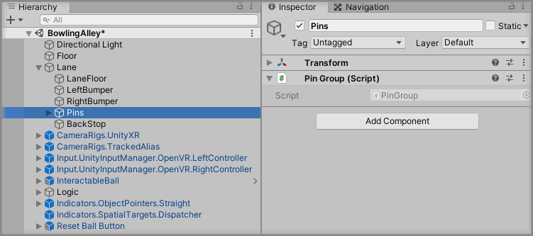

Now we just need to add another Click Button like we did in [Step 5](#Step-5) but this time rename the `Interactions.SpatialButton.ClickButton` GameObject to `Reset Pins Button` and change the `Transform` properties to:

* Position: `X = 1.5, Y = 1.1, Z = -7.5`
* Rotation: `X = 0, Y = 40, Z = 0`

Then update the Button Styles on the `Spatial Button Facade` component to change the wording on the different states of the buttons:

* Enabled Inactive -> Button Text: `Reset Pins`
* Enabled Hover -> Button Text: `Reset Pins`
* Enabled Active -> Button Text: `Reset Pins`
* Disabled Inactive -> Button Text: `Reset Pins`
* Disabled Hover -> Button Text: `Reset Pins`

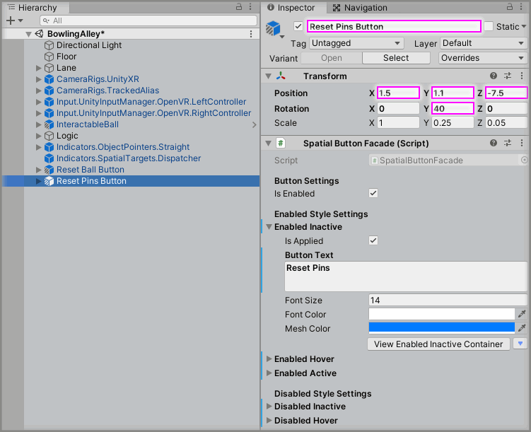

Select the `Reset Pins Button` GameObject from the Unity Hierarchy window and click the `+` symbol in the bottom right corner of the `Activated` event parameter on the `Spatial Button Facade` component.

Drag and drop the `Lane -> Pins` GameObject into the event listener box that appears on the `Activated` event parameter on the `Spatial Button Facade` component that displays `None (Object)`.

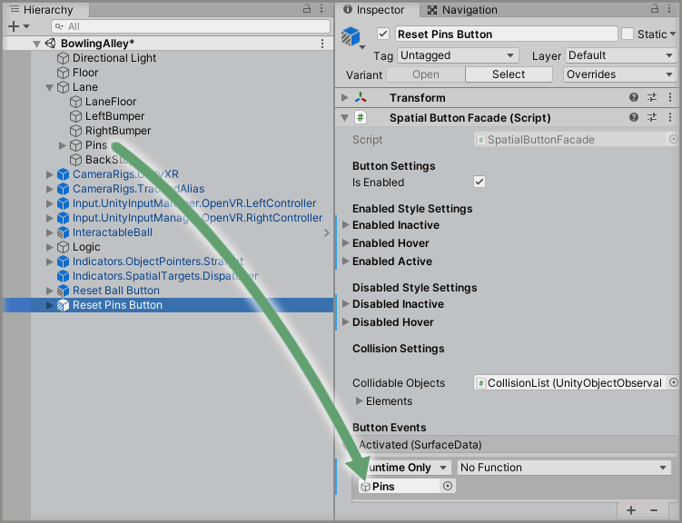

Select a function to perform when the `Activated` event is emitted. For this example, select the `PinGroup -> ResetPositions` function.


> You could also make the `Reset Pins Button` call the reset ball position logic so you always get a fresh ball when the pins are reset.

> [see commit #fc09c02](https://github.com/ExtendRealityLtd/VRTK.Tutorials.VRBowling/commit/fc09c024c3b19e1346e9642efa5b65ed1b68f1ee)

### Done

Now if you play the Unity scene, you'll have the foundations of your very own bolwing game. Pick up the ball, try for a strike, if you miss then just recall the ball but if you knock them all down you can now just reset the pins.


[Making A VR Bowling Game]: ../MakingAVRBowlingGame/README.md
[Unity Physics Materials]: https://docs.unity3d.com/Manual/class-PhysicMaterial.html
[Adding A Straight Pointer]: https://github.com/ExtendRealityLtd/Tilia.Indicators.ObjectPointers.Unity/tree/master/Documentation/HowToGuides/AddingAStraightPointer/README.md
[Adding A Click Button]: https://github.com/ExtendRealityLtd/Tilia.Interactions.SpatialButtons.Unity/tree/master/Documentation/HowToGuides/AddingAClickButton#step-3